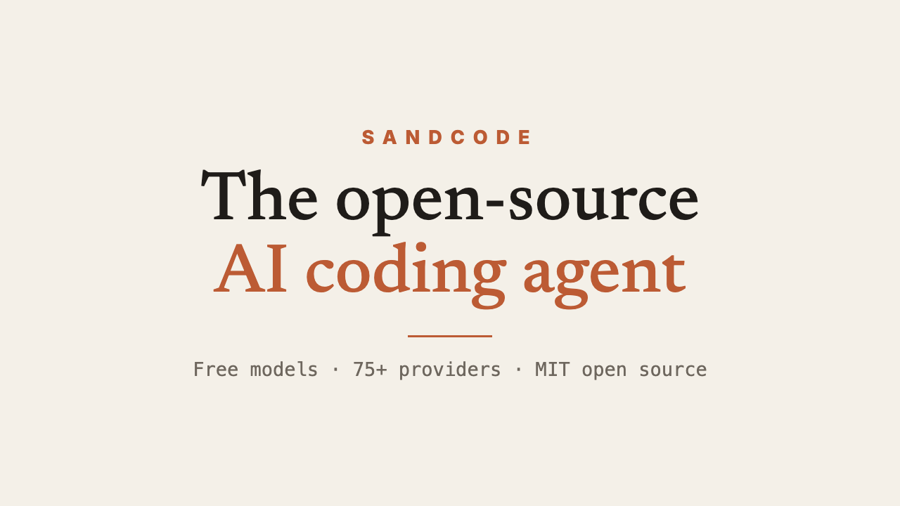
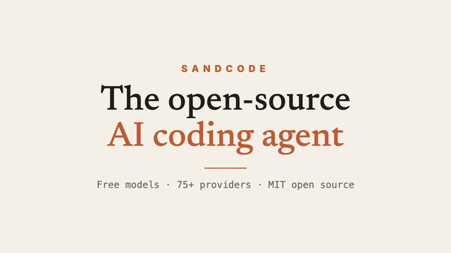

# Sandcode — opencode.ai-style demo site (English)

 brisk demo site inspired by opencode.ai, rebranded as Sandcode. All English.

## Product intro

[](./remotion/out/sandcode-intro.mp4)



> Full video: [`remotion/out/sandcode-intro.mp4`](./remotion/out/sandcode-intro.mp4) (24s, 720p, Remotion).
> Re-render: `cd remotion && npm install && npm run render`.

## Pages
- `index.html` — home: hero, install tabs, animated terminal, logo strip, bento features, stats, quotes, use-case tabs, privacy, FAQ, changelog cards, Zen banner, waitlist
- Motion: GSAP hero timeline, scroll reveals, stat count-up, logo marquee (`vendor/` local GSAP + ScrollTrigger); legacy IO reveal fallback when GSAP missing or reduced-motion on.
- `download.html` — Terminal / Desktop / Extensions / Integrations + FAQ
- `go.html` — Go pricing: individuals (Go $1 / GOAT $10 / Pro $20 / Max $100 / Max 20× $200), Provider API ($15), Teams ($40), Enterprise (custom), comparison table, FAQ
- `zen.html` — Zen models: problem, how it works, testimonials, FAQ
- `docs.html` — condensed docs: Install / Configure / Init / Usage
- `enterprise.html` — enterprise privacy page
- `workspace-*.html` (+ `workspace.css` / `workspace-pages.js`) — dark workspace app (mock, no backend).
- Workspace sub-pages (mock, `workspace-pages.js`): `workspace-overview` (plan + stats + top models), `workspace-go` (rolling/weekly/monthly usage, allowances, provider toggles), `workspace-usage` (daily chart, per-model table), `workspace-billing` (balance top-up, invoices), `workspace-keys` (create/copy/regenerate/revoke), `workspace-members` (roles, invite), `workspace-settings` (profile, share mode, danger zone).
- `style.css` / `script.js` — shared styles + interactions (tabs, copy fallback, mobile menu, waitlist, terminal typing)
- `tokens.css` — design tokens, single source of truth (type, brand amber, radius 14/10, shadows, motion, layout). Loaded before `style.css` / `workspace.css`; both build on it.
- `i18n.js` + `i18n-dict-{a,b,c}.js` — EN ⇄ 中文 toggle (auto-injected button, persisted, dynamic content observed). ~530-entry dictionary; code/numbers/names stay English.

## Visual contract
Claude-inspired editorial theme: cream paper, warm ink, terracotta accent, Newsreader serif display (italic accent words) + Inter body. Marketing pages are centered-hero with pill CTAs, product terminal frame, logo strip, hairline sections, fat footer. Workspace is a dark app sharing the same tokens (type, accent family, radius, elevation).

## Run locally
```bash
cd "/Users/qumo/Documents/Others/Sandbase/sandcode"
python3 -m http.server 8080
# open http://localhost:8080/index.html
```

## Naming map
opencode → sandcode / Sandcode
opencode.ai → sandcode.ai
`opencode-ai` npm package → `sandcode-ai`
`anomalyco/tap/opencode` → `sandcode/tap/sandcode`
OpenCode Zen → Sand Zen
